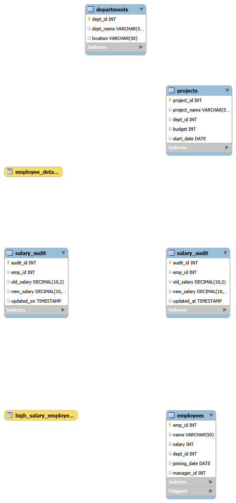

# SQL Employee Management and Business Reporting System

## 📌 Project Overview

This project is a complete SQL-based Employee Management and Business Reporting System developed using MySQL. It demonstrates database design, data management, and advanced SQL concepts commonly used in real-world business applications.

The project manages employee, department, and project information while generating useful business reports through SQL queries.

---

## 🚀 Features

- Employee Management
- Department Management
- Project Management
- Salary Reports
- Business Reporting
- Stored Procedures
- Views
- Triggers
- Transactions
- Indexes
- Window Functions

---

## 🛠 Technologies Used

- MySQL 8.0
- SQL
- MySQL Workbench

---

## 📂 Project Files

- database_creation.sql
- table_creation.sql
- insert_data.sql
- joins_queries.sql
- subqueries.sql
- window_functions.sql
- views.sql
- stored_procedures.sql
- triggers.sql
- transactions.sql
- indexes.sql

---

## 📚 SQL Concepts Covered

- DDL Commands
- DML Commands
- Constraints
- Primary Keys
- Foreign Keys
- INNER JOIN
- LEFT JOIN
- RIGHT JOIN
- SELF JOIN
- Aggregate Functions
- GROUP BY
- HAVING
- ORDER BY
- Subqueries
- Window Functions
- Views
- Stored Procedures
- Triggers
- Transactions
- Indexes

---

## ▶️ How to Run

1. Create the database.
2. Execute `table_creation.sql`.
3. Execute `insert_data.sql`.
4. Run the remaining SQL files one by one.

---

## 🎯 Learning Outcome

This project demonstrates practical SQL skills required for entry-level Data Analyst, SQL Developer, Database Developer, and Software Engineer roles.

---
## 📸 Project Screenshots

### Database Tables

### JOIN Query

### Stored Procedure

### Trigger

## 🗂️ Entity Relationship Diagram (ERD)

The following diagram represents the database schema and relationships between tables.

## 👩‍💻 Author

**Fathima Shaik**
